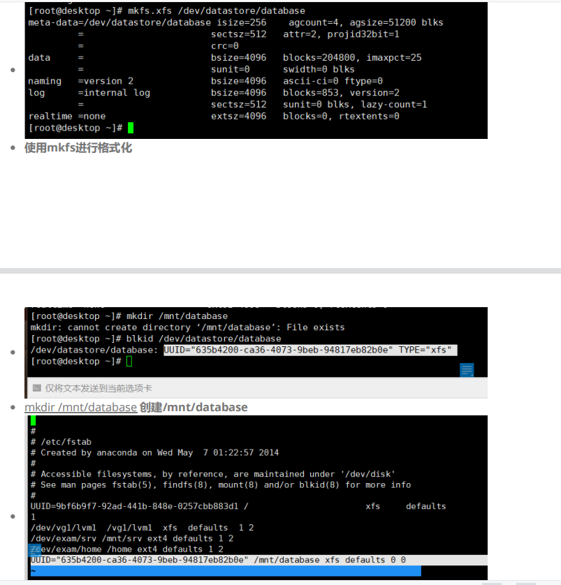
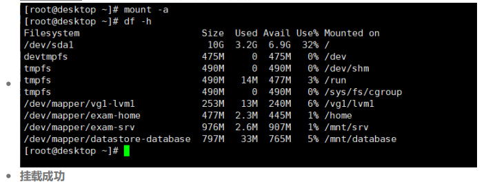

# YUM

> YUM（yellowdog updater modified）是一个RPM系统的自动更新和软件包安装/卸载器。它可以自动计算依赖和找出想要安装的软件包。这使得它更容易而不必手动更新每一个使用RPM维护机器的”软件组“。YUM有一个添加简单功能的插件接口。

---

```shell
yum clean all #清除所有仓库的缓存
```

```shell
yum makecache #重建仓库
```

```shell
yum repolist all #列出所有仓库
```

```shell
yum prolides #根据特定条件搜索软件包
```

```shell
yum whatprovides */文件名 #查看文件属于哪个软件包安装的
```

```shell
yum list #列出仓库中所有软件包
```

```shell
yum info #查看软件包信息
```

```shell
yum install #安装 跟-y的话无需手动去确认是否安装
```

```shell
yum reinstall #重新安装软件包
```

```shell
yum remove #卸载
```

```shell
yum update #更新（需要联网）
```

```shell
yum check-update #检查可更新的软件包（需要联网）
```

```shell
yum grouplist #查看组服务
```

```shell
yum groupinstall #安装组服务
```

---

> 
>
> <u>1.为什么要yum安装？</u>

linux系统中安装软件常用的有三种方式：第一种，rpm命令安装，第二种，yum源安装，第三种，源码编译安装。

第一种，rpm命令用来安装指定的rpm包，需要指定rpm包的名称，如果是没有依赖其他包的话，这种安装比较简单，直接指定包名安装就可以了，如果要安装的包又依赖其他包，就比较麻烦，需要指定依赖的包。

第二种，yum源安装，安装的还是rpm包，解决了依赖的问题，更方便快捷。

第三种，一般步骤是 ./configure  , make , install 

> 
>
> 2.<u>yum安装步骤</u>

第一步：找到yum配置文件

以Centos为例，默认情况yum源的配置文件是在/etc/yum.repos.d目录下。在这个目录下，你可以自己新建配置文件，也可以在默认的配置文件基础上修改。配置文件后缀为repo

在配置文件中，可以指定你要安装的包在哪里。指定的方式有以下几种：

第一种：本地（配置文件示例）

```shell
[other]     
name=other_yum     //yum源的名称，自己命名，不能重复
baseurl=file:///mnt/other    //这里是自己建的目录，挂载iso文件。
gpgcheck=0
enabled=1
```

第二种：网络（配置文件示例）

```shell
[aliyun]     
name=aliyun_yum     //yum源的名称，自己命名，不能重复
baseurl=https://mirrors.aliyun.com/centos/$releasever/os/x86_64/
gpgcheck=0
enabled=1
```

第二步：安装需要的包

例如 yum -y install gcc

这个命令就会到配置文件中的yum源，找到安装包和依赖的包，自动安装。如果yum源中找不到依赖的包，会给出提示。

> 
>
> <u>3.yum的常用参数</u>

- h：显示帮助信息；

- y：对所有的提问都回答“yes”；

- c：指定配置文件；

- q：安静模式；

- v：详细模式；

  

---


# 格式化mkfs

* **如果我们购买一个新的虚拟主机空间或者要更改操作程序，会经常使用到磁盘格式化来清空以前的数据，磁盘格式化的方法很多，我们常用的是NTFS和linux格式化命令两种方法来格式化磁盘**

  

```shell 
[root@wy~]#mkfs -t type dev
```

| command | description                                            |
| :-----: | :----------------------------------------------------- |
|  mkfs   | 格式化命令，创建文件系统make filesystem                |
|   -t    | 指定文件系统类型                                       |
|  type   | 具体的文件系统类型 比如：ext2，ext                     |
|   dev   | 设备文件，一般是分区（千万别对整个磁盘直接进行格式化） |


* <u>查看 mkfs 支持的文件格式</u>

```shell
[root@wy~]# mkfs[tab][tab]
mkfs         
mkfs.cramfs  
mkfs.ext2    
mkfs.ext3    
mkfs.msdos   
mkfs.vfat
```

*按下两个[tab]，会发现 mkfs 支持的文件格式如上所示。*


* 将分区 /dev/hdc6（可指定你自己的分区） 格式化为 ext3 文件系统：

```shell
[root@wy ~]# mkfs -t ext3 /dev/sdb6
mke2fs 1.39 (29-May-2006)
Filesystem label=                < ==这里指的是分割槽的名称(label)
OS type: Linux
Block size=4096 (log=2)          <==block 的大小配置为 4K 
Fragment size=4096 (log=2)
251392 inodes, 502023 blocks     <==由此配置决定的inode/block数量
25101 blocks (5.00%) reserved for the super user
First data block=0
Maximum filesystem blocks=515899392
16 block groups
32768 blocks per group, 32768 fragments per group
15712 inodes per group
Superblock backups stored on blocks:
        32768, 98304, 163840, 229376, 294912

Writing inode tables: done
Creating journal (8192 blocks): done <==有日志记录
Writing superblocks and filesystem accounting information: done

This filesystem will be automatically checked every 34 mounts or
180 days, whichever comes first.  Use tune2fs -c or -i to override.
```


>  **例子 ：**
>
>  **在 /dev/hda5 上建一个 msdos 的档案系统，同时检查是否有坏轨存在，并且将过程详细列出来 ：**
>
> ```shell
> [root@wy~]#mkfs -V -t msdos -c /dev/sda5
> 
> [root@wy~]#mfks -t ext3 /dev/sda6  
> //将sda6分区格式化为ext3格式
> 
> [root@wy~]#mkfs -t ext2 /dev/sda7   
> //将sda7分区格式化为ext2格式
> ```






